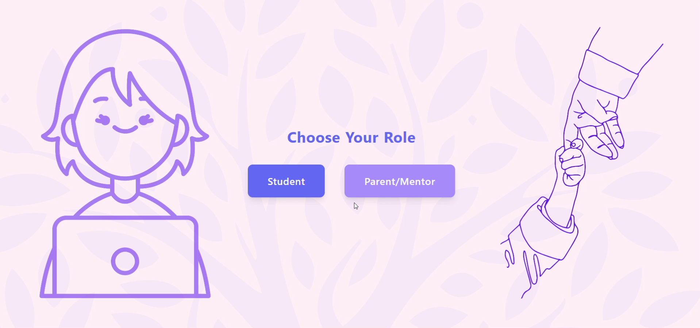

# CODERECET

## Project Repository
*Commit and save your changes here*

### Team Name : 
NeuroNova

### Team Members : 
Aleena Sidhikh
H Athila
Minhaj Noushad
Tharun Krishna C U

### Project Description 
🧠 NeuroPaths – Empowering Every Mind to Learn Differently
NeuroPaths is an AI-driven, emotion-aware learning platform that empowers students with learning disabilities like dyslexia, ADHD, and dyscalculia. Designed with inclusivity at its core, the platform personalizes the learning experience by adapting content delivery style, pace, and difficulty based on the learner’s real-time emotional state.

Using facial expression recognition via webcam, NeuroPaths can detect frustration, fatigue, or confusion and respond by changing the content format — such as switching from visual to auditory — or slowing down the learning pace. It features a gamified learning journey, an accessible interface with dyslexia-friendly fonts and narration, and a dedicated dashboard for parents and educators to monitor progress and emotional trends.

🔑 Key Highlights:
Real-time emotion recognition using face-api.js

Personalized delivery styles: visual, auditory, and kinesthetic

Gamified progress tracking with badges and streak rewards

Dyslexia-friendly UI with accessibility-focused design

Dashboard for emotional and academic insights

Aligns with SDG 4 – Quality Education

NeuroPaths bridges the gap between education and emotional intelligence, ensuring that neurodiverse learners are not only included but empowered to thrive.

## Technical Details
🛠️ Technical Details
NeuroPaths is a web-based platform built using React.js and Tailwind CSS, focused on delivering emotion-aware and personalized learning experiences for students with dyslexia and ADHD.

Google Gemini API is used for:

📷 Emotion detection (via webcam snapshots)

✍️ Dynamic content generation (adapting content style, difficulty, and format)

Recharts is used for visual progress and emotion tracking

LocalStorage stores user data temporarily on the client

All emotion and content adaptation happens securely, with no facial data stored

The system adjusts pacing, format (audio/visual), and delivery mode based on mood, making learning more inclusive and responsive.

## For Software:
NeuroPaths is a web-based educational platform developed using React.js for building a dynamic and modular user interface, and Tailwind CSS for responsive and accessible styling. React Router DOM manages page navigation across the platform. The system uses the Google Gemini API (Vision) to process webcam snapshots and detect the user’s emotional state (positive, neutral, negative), and the Gemini API (Text) to dynamically personalize content based on both emotional cues and selected learning challenges such as dyslexia or ADHD. Data visualization is handled using Recharts, while LocalStorage is used for client-side session management. To enhance usability and inclusivity, the interface integrates OpenDyslexic fonts, high-contrast modes, and audio narration options to support neurodiverse learners.

[Languages Used]

JavaScript

HTML

CSS

Python

[Frameworks Used]

React.js (Frontend)

Flask (Backend)

[Libraries Used]

React Router DOM

Tailwind CSS

Recharts

[Tools Used]

Google Gemini API (Vision & Text)

Netlify (Deployment - Frontend)

Flask Server (API integration - Backend)

## Implementation
## For Software: 
The NeuroPaths platform is implemented as a full-stack web application designed for emotion-aware adaptive learning. The system integrates both frontend and backend components to deliver a personalized experience for neurodiverse learners, particularly those with dyslexia and ADHD.

🔹 Frontend (React.js)
Built using React.js with Tailwind CSS for responsive, accessibility-first design.

Includes routes managed by React Router DOM for smooth navigation between login, mode selection, learning modules, and dashboards.

Implements visual tools using Recharts for emotion trends and progress analytics.

Offers accessibility enhancements like OpenDyslexic font, high-contrast themes, and audio-based learning options.

Dynamically updates learning module format based on emotional feedback and learning mode (visual, auditory, kinesthetic).

🔹 Backend (Flask + Gemini API)
A lightweight Flask server handles requests from the frontend.

Captured webcam snapshots (3 per session: start, middle, end) are sent to the backend.

The Flask backend calls the Google Gemini Vision API to classify emotion as positive, neutral, or negative.

The resulting emotion state is returned to the frontend to adjust pacing, content difficulty, and mode.

For dynamic content adaptation (simplifying text, generating explanations, etc.), the Gemini Text API is used via Flask to respond based on emotional state and learner type.

🔹 Storage & State
LocalStorage is used to store temporary session data such as user login, emotion responses, and progress.

Data privacy is ensured by avoiding persistent storage of webcam images or personal identifiers.

### Installation
git clone <https://github.com/Minhaj401/CODERECET>

cd neuropaths

npm install   (for React frontend)

cd backend

pip install -r requirements.txt   (for Flask backend)

npm run dev   (to start the frontend dev server)

python app.py   (to run the Flask backend)

### Run
npm run dev

python app.py

### Project Documentation
Project Name: NeuroPaths

Description: An AI-driven, emotion-aware learning platform designed to support students with dyslexia and ADHD by adapting content based on their emotional state and learning needs.

Frontend: React.js, Tailwind CSS, React Router DOM, Recharts

Backend: Python Flask (for Gemini API calls)

APIs Used: Google Gemini API (Vision for emotion detection, Text for content adaptation)

Accessibility Features:

OpenDyslexic font

High-contrast mode

Audio narration

Visual learning support

Key Modules:

User Authentication

Learning Mode Selection (Visual, Auditory, Kinesthetic)

Emotion-Based Adaptation (Captured at start, mid, and end)

Dynamic Content Generation (based on mood + learning style)

Progress Tracking with Graphs and Gamification

Parent/Educator Dashboard

Deployment: Frontend via Netlify; Backend runs on local Flask server

### Screenshots

### Project Demo
### Video
https://drive.google.com/file/d/1a-UPxrkwbv1cjfjUetom70LXhHKPi-In/view?usp=sharing

## Team Contributions
[Minhaj Noushad]: [Full Stack Developer]
[Aleena Sidhikh]: [Designing]
[H Athila]: [Designing]
[Tharun Krishna C U]: [UI Designing]
